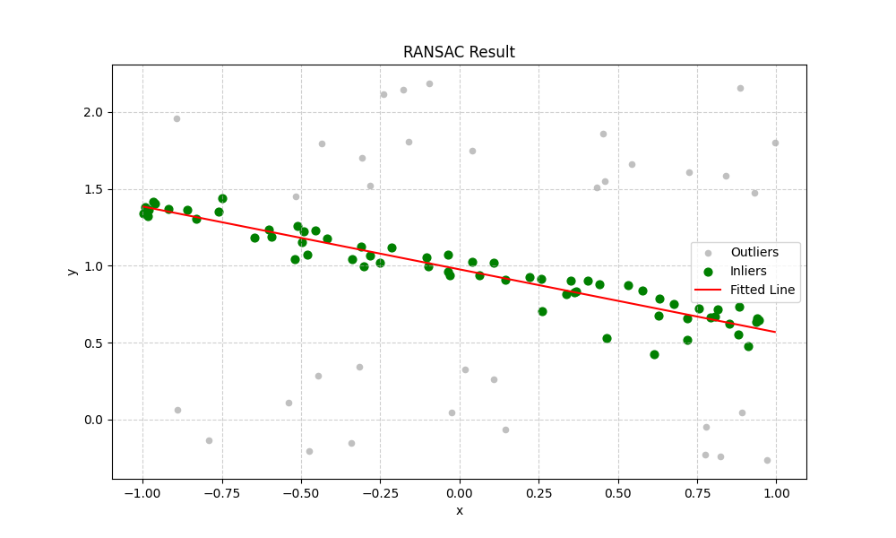

# Robust Linear Regression using RANSAC

This project provides a from-scratch implementation of the **RANSAC (Random Sample Consensus)** algorithm in Python. It demonstrates how to robustly fit a linear model to 2D data that has been significantly corrupted with outliers, succeeding where traditional methods fail.

## About the Source Code
This project is written in Python 3 and uses the following standard libraries for scientific computing and visualization:
* **NumPy**: For efficient numerical operations and array manipulations.
* **Matplotlib**: For visualizing the data and results.
* **Scikit-learn**: For the `PolynomialFeatures` helper class to format the model's design matrix.

The code is structured into modules for data generation, dataset handling, and the core RANSAC algorithm itself.

## The Challenge: Identifying a Pattern in Noise

In many real-world scenarios, data is not perfect. It often contains a mixture of "inliers"—data points that follow a true underlying model—and "outliers," which are anomalous points that do not fit. The first step is to visualize the problem.

### 1. The Initial Noisy Data

We begin with a dataset where the true linear trend is heavily obscured by "salt-and-pepper" noise—extreme outliers that are far from the main data cloud.


> **Figure 1: The Generated Dataset.** A clear linear trend is hidden within a large number of randomly distributed outliers.

---

### 2. Why Standard Linear Regression Fails

A traditional method like Least Squares Linear Regression attempts to fit a line to *all* points. The extreme values of the outliers pull the regression line far away from the true trend, resulting in a completely incorrect model.


> **Figure 2: The Failure of Standard Regression.** Applying a standard linear regressor to the noisy dataset results in a completely incorrect model that is heavily skewed by the outliers.

---

### 3. The RANSAC Solution

RANSAC (Random Sample Consensus) is an iterative method that solves this problem by finding a consensus among the data. By repeatedly sampling small subsets of points, fitting models to them, and checking how many other points support each model, it can effectively ignore the outliers and identify the true underlying pattern.

The final result is a regression line that robustly captures the trend of the inliers.


> **Figure 3: The RANSAC Result.** The algorithm successfully ignores the outliers (silver), identifies the true inliers (green), and fits a line (red) that accurately represents the underlying data.

<!-- ## Quick Start
To run the project and reproduce these results on a newly generated dataset:

1.  Ensure all project files (`ransac.py`, `generators/`, `dataset/`, etc.) are in place.
2.  Execute the main script from your terminal:
    ```bash
    python ransac.py
    ```
3.  The script will generate a new dataset, run the RANSAC algorithm, and display the final visualization. You can tune the algorithm's parameters (`n_iterations`, `threshold`, etc.) in the `if __name__ == '__main__':` block at the bottom of `ransac.py`. -->

